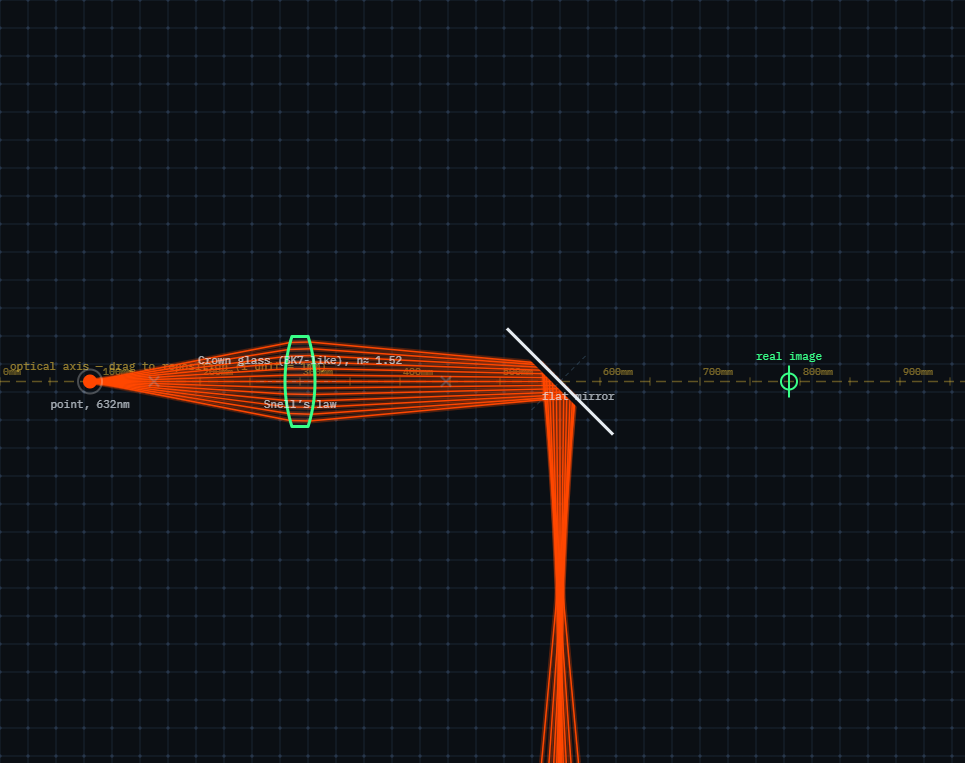

# Optical Bench

A draggable, interactive optics playground that runs entirely in the
browser — no build step, no dependencies. Drag a light source, lenses,
mirrors, and a dispersive prism around an optical-table canvas and watch
real physics compute every ray bend live.

**[Live demo →](#)** *(add your GitHub Pages link here once deployed)*



## What it does

- **An optical axis you can build on.** A horizontal reference line runs
  across the bench. Drag any element near it and it snaps into alignment —
  drag it away and it's free again. Drag the axis itself to reposition your
  whole reference line.
- **Two lens models.** Toggle a lens between an *ideal thin lens* (the
  graphical construction taught on paper) and a *realistic lens* that traces
  actual Snell's law through two spherical glass surfaces you define by
  radius of curvature, thickness, and glass type — real spherical
  aberration and all.
- **Flat, concave, and convex mirrors**, each reflecting correctly with the
  focusing behavior of a real spherical mirror.
- **A dispersive prism.** Its refractive index depends on wavelength (via
  Cauchy's equation), so switch on "white light" and watch a single beam
  split into a visible-spectrum rainbow — or dial the source wavelength by
  hand and watch the bend angle shift in real time.
- **A live image-formation readout.** Select a lens and see the actual
  object distance, image distance, magnification, and whether the image is
  real/virtual and upright/inverted — computed from the thin-lens equation
  as you drag things around.
- **Quantitative controls everywhere.** Every slider has a paired number
  field for exact values — position, angle, focal length, radii, apex
  angle, wavelength — so you can dial in a precise configuration, not just
  eyeball it.

## The physics

**Ideal lenses** use the classic thin-lens *graphical ray-tracing
construction*: a ray through a lens's optical center is never deviated, so
every ray parallel to it must bend to cross the same point on the focal
plane. `refractThinLens` in `src/optics.js` implements exactly this rule,
generalized to rays at any angle and lenses at any position/orientation —
not just rays along one fixed optical axis.

**Realistic lenses** trace real vector Snell's law
(`n₁ sinθ₁ = n₂ sinθ₂`, solved as a vector equation, not a paraxial
approximation) through two spherical surfaces, using the standard
lensmaker sign convention (a surface radius is positive if its center of
curvature sits on the outgoing side). A biconvex lens is `R1 > 0, R2 < 0`.
Because this traces the *actual* geometry rather than an idealized
approximation, rays far from the axis focus slightly differently than
paraxial rays — genuine spherical aberration falls out of the math for
free.

**Mirrors** reflect with angle of incidence equal to angle of reflection.
Curved mirrors add a focusing correction equivalent to a thin lens of focal
length `f = R/2` — a standard equivalence for paraxial spherical mirrors —
applied *after* the flat reflection, so the same `refractThinLens` helper
does double duty here.

**The prism** refracts through two real flat glass faces using the same
vector Snell's law as the realistic lens. Its index of refraction follows
Cauchy's equation, `n(λ) = A + B/λ²`, so shorter (bluer) wavelengths bend
more than longer (redder) ones — the actual reason a prism splits white
light into a rainbow, not a hand-wavy color gradient.

**Total internal reflection** is handled as a real physical case, not an
edge-case crash: if light hits a glass-to-air boundary steeper than the
critical angle, it reflects back into the material instead of vanishing.

## Project structure

```
optical-bench/
├── index.html          # page shell + full control panel markup
├── style.css             # optical-table visual theme
├── src/
│   ├── optics.js          # pure physics/math — no DOM code
│   ├── render.js          # canvas drawing — no physics code
│   └── interaction.js     # scene state, dragging, panel wiring
└── README.md
```

The split between `optics.js` (math), `render.js` (drawing), and
`interaction.js` (state/UI) is deliberate: you can read the ray-tracing
logic in `optics.js` without any canvas or event-handling code in the way.
Every element type (lens, mirror, prism) implements the same two-function
interface — `findElementHit` and `propagateElement` — so `traceRay` stays a
short, generic loop regardless of how complex an individual element's
internal physics is.

## Running it locally

No build tools, no npm install. Just open `index.html` in a browser, or
serve the folder locally:

```bash
python3 -m http.server 8000
# then visit http://localhost:8000
```

## Deploying to GitHub Pages

1. Push this repo to GitHub (as a **public** repo — Pages needs that on the
   free plan).
2. Go to **Settings → Pages**.
3. Under "Build and deployment," set **Source** to `Deploy from a branch`,
   branch `main`, folder `/ (root)`.
4. Save — GitHub will publish it at `https://<username>.github.io/<repo>/`
   within a minute or two.

## Try this

- Add a lens, switch it to **Realistic**, and drag the source close — watch
  the outer rays focus short of the paraxial focal tick marks. That's real
  spherical aberration, not a bug.
- Add a prism, check **Simulate white light**, and aim the source at ~0°
  incidence to the prism's face — you should see a clean rainbow fan out.
  Switch the prism's glass to *flint* for a much more dramatic spread.
- Put a lens on the axis, drag the source further than the focal length
  away, and watch the **Image formation** panel report a real, inverted
  image — then drag the source inside the focal length and watch it flip
  to virtual and upright.

## Ideas for extending it further

- A second prism or lens after the first, to recombine a dispersed
  spectrum back into white light (Newton's classic experiment)
- Polarization and a simple Malus's-law polarizer element
- An anti-reflection coating toggle showing partial reflection at each
  glass surface, not just transmission
- Exporting the current scene configuration as shareable JSON

## License

MIT — see [LICENSE](LICENSE).
